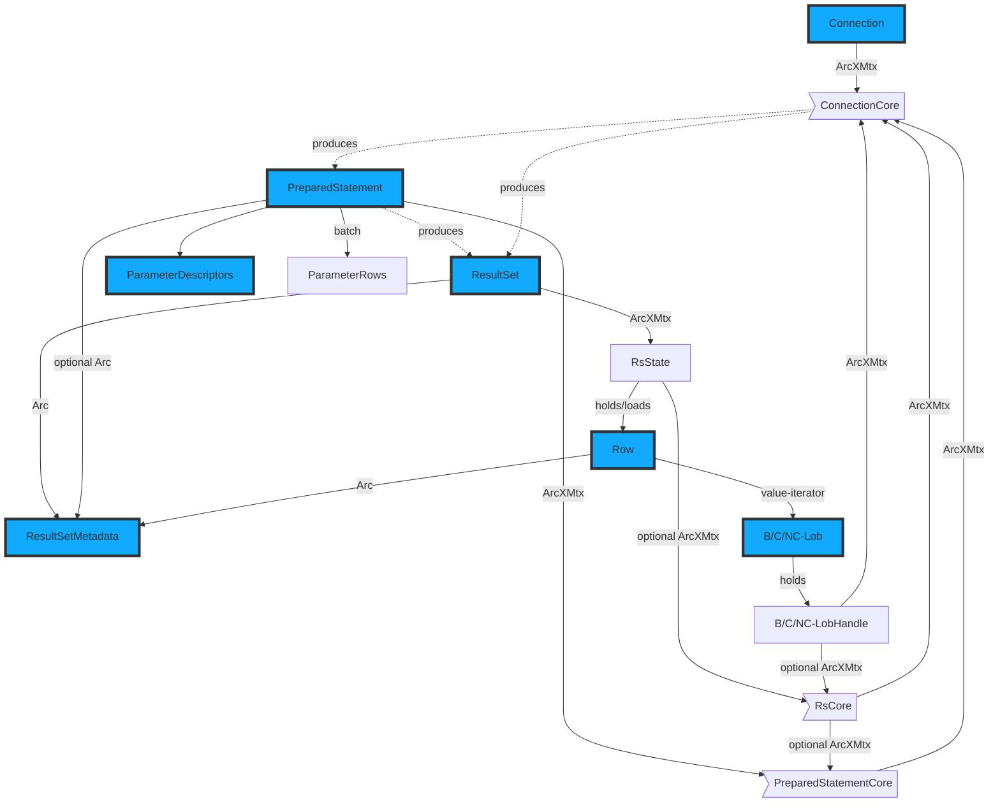

# References and Lifetimes within `hdbconnect` and `hdbconnect_async`

Legend:

`ArcXMtx` is either an `Arc<std::sync::Mutex>` or an `Arc<tokio::sync::Mutex>.`

## Sharing objects

Example: a `ResultSetMetadata` object e.g. can be used by a `ResultSet`, its `Row`s and a `PreparedStatement`.

## Rust Lifetimes control drop of server-side resources

The lifetimes of the public objects are controlled by the application.

By using the depicted Core objects and the internal references to them,
we ensure that each public object remains usable for its entire own lifetime,
without forcing the application to keep other objects alive.

The Core objects have a Drop implementation that releases the corresponding server-side ressource
when they are dropped themselves.

A `ResultSet` object e.g. will be able to fetch outstanding rows from the server
even if the application already dropped the conection object,
because it keeps the `RsCore` and the `ConnectionCore` objects alive until all data
are loaded.
