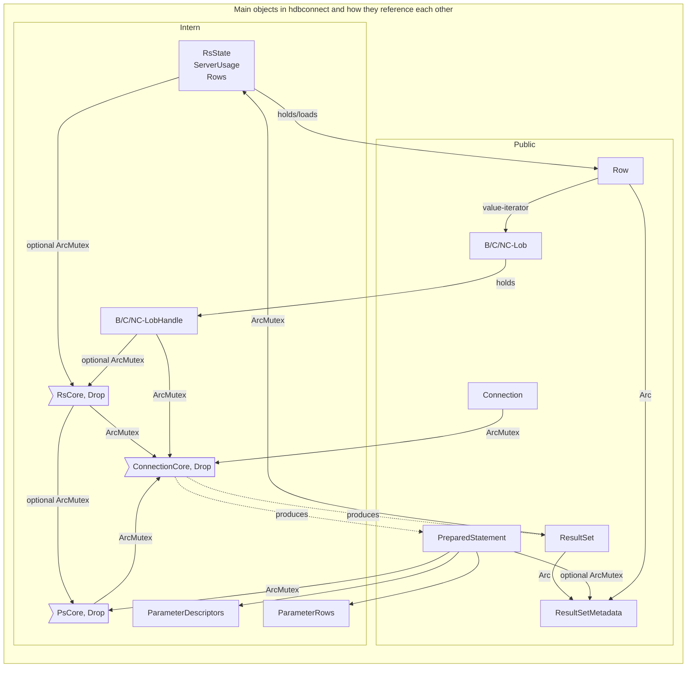

# Test

Objects with Drop implementation (ConnectionCore, ResultSetCore, PreparedStatementCore)
release the corresponding server-side ressource when they are dropped themselves.

The hard ref chain from LobHandle to ConnCore ia needed for `read_slice`,
which is supposed to work independently from the streaming-like content loading.

TODO: don't we then also need the RsCore, which is thrown away once the content was loaded completely?
