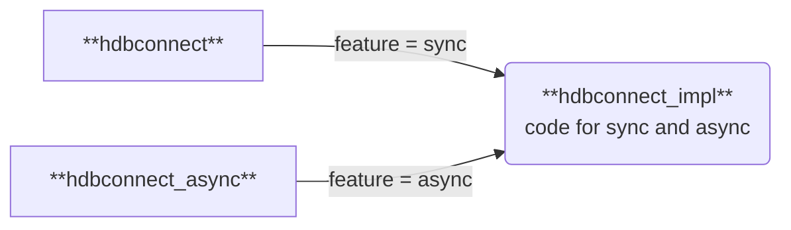

# Design and Architecture

This document describes in some detail the code structure of `hdbconnect` and `hdbconnect_async`, 
two closely related database drivers for SAP HANA(TM), written in pure rust.

## sync and async

As their names might suggest,
- `hdbconnect` is a classical synchronous database driver (it blocks the cutrrent thread after a 
  request is sent to the database until the response is received),
- while `hdbconnect_async` supports rust's async model which avoids blocking OS threads.

Rust's async model comes with a far-reaching impact: async methods have a different signature
than sync methods, and can only be called in async methods.

Unifying significant parts of the driver code is still possible, due to the following:
- code that is not concerned with I/O is written in sync form only and can be used in both variants
- building requests and parsing responses is done only synchronously
- sending and receiving is done in both forms
- all methods that call either of these also exist in both forms.

## Project structure
The hdbconnect repository is a cargo workspace with three crates:
### `hdbconnect_impl`
- Contains more than 95% of the code.
- Many of its structs and enums are used for both cases.  
- Some of these structs and enums have 
    **pairs of corresponding methods**, one for the sync case and one for the async case, like 
    ```rust
    #[cfg(feature = "sync")]
    pub fn send_sync(&self, request: Request) -> HdbResult<Reply> {
        // impl omitted
    }
    #[cfg(feature = "async")]
    pub async fn send_async(&self, request: Request<'_>) -> HdbResult<Reply> {
        // impl omitted
    }
    ```
    The sync methods have names that end with `_sync` and are only available with 
    `hdbconnect_impl`'s feature `sync`, the async methods have names that end with `_async` and 
    are only available with `hdbconnect_impl`'s feature `async`.

    This allows having corresponding methods on the same class and next to each other, and to 
    ensure that no method
    is compiled if it is not needed.
- The classes that serve a single feature only are put into the modules `sync` and `a_sync`. Here
  we find some of the customer-facing classes.



### `hdbconnect`
This is the sync driver library. It depends on `hdbconnect_impl` with feature `sync` and adds
code for plugging into the synchronous db connection pool `r2d2`.

### `hdbconnect_async`
This is the async driver library. It depends on `hdbconnect_impl` with feature `async` and adds
code for plugging into the asynchronous db connection pools `bb8` and `rocket_pool`.


## API

Main goals for the API design should be ease-of-use and performance.

### Ease of use

#### Easy conversion of result sets to standard rust types

The support for converting result sets into custom rust types is maybe the most prominent aspect
for ease of use. Its realization is based on `serde_db`, a library that was factored out from an
early version of `hdbconnect`. It makes it really easy to read data from the database. 

#### Easy parallelization

Database interaction is realized with non-mutating methods such that 
e.g. multiple consumers (multiple threads in sync case) can evaluate a single result set 
without having to care about synchronization.
We use interior mutability and lock dynamically the internally kept objects (like e.g. 
`AmConnectionCore`).

#### Automatic cleanup of server-side ressources

Connections, prepared statements and result sets with more than 16 rows have concomitant server-side
representations on which they rely.
Apropriate `Drop` implementations in our core objects ensure an automatic cleanup of server-side
ressources in the correct moment.

Furthermore, result sets e.g. can depend on prepared statements and connections. Such
dependencies are handled by using ref-counted references.

See the separate document [`./References.md`](./References.md) for a comprehensive dependency graph.

The ref-counted references are implemented as `Arc<XMutexed>`, where `XMutexed` is an enum with two
feature-gated variants `Sync` and `Async`. With normal compilation only one of the variants exists.
The `Sync` variant is a newtype wrap of `std::sync::Mutex`, the `Async` variant of
`tokio::sync::Mutex`.[^1]

[^1]: This one of the few points where hdbconnect_async had to make a choice between tokio and async_std, the two main eco systems for rust async.
 
#### Documentation

The API documentation on docs.rs should help consumers as far as possible.
An important part of it are the
[code examples](https://docs.rs/hdbconnect/latest/hdbconnect/code_examples/index.html),
which should make it easy to get quickly started. 

### Performance

The implementation tries to avoid allocations where possible, and to use idiomatic rust to help
the compiler to generate optimal code.

## Architecture

`Connection`, `PreparedStatement`, and `ResultSet` are three prominent 
'active' API structs. They implement `Send` and `Sync` and can 
fearlessly be used concurrently. 'Active' means they have methods that 
lead to requests being sent to the server. `Connection::statement` e.g. 
sends the query String to the server and returns the database's response.

All active objects have a direct or indirect reference to the inner connection
object, `AmConnCore` = `Arc<XMutex<ConnectionCore>>`,
which is the central entry point for the communication to the database,
as it comprises the central method pair for sending requests:

```rust
    #[cfg(feature = "sync")]
    pub(crate) fn full_send_sync(
        &self,
        mut request: Request,
        o_a_rsmd: Option<&Arc<ResultSetMetadata>>,
        o_a_descriptors: Option<&Arc<ParameterDescriptors>>,
        o_rs: &mut Option<&mut RsState>,
    ) -> HdbResult<Reply> {
        // implementation omitted
    }


    #[cfg(feature = "async")]
    pub(crate) async fn full_send_async(
        &self,
        mut request: Request<'_>,
        o_a_rsmd: Option<&Arc<ResultSetMetadata>>,
        o_a_descriptors: Option<&Arc<ParameterDescriptors>>,
        o_rs: &mut Option<&mut RsState>,
    ) -> HdbResult<Reply> {
        // implementation omitted
    }
```

The active structs build the `Request` obect with all needed parts,
hand it over as a parameter, and evaluate the returned `Reply`.

#### Protocol

`Request` and `Reply` are the main objects of the communication protocol.
They consist of a fixed-size header and some subobjects which are called `Part`s. 
In our implementation,`Part` is a rust enum with about 30 variants.
Some variants are used in requests only, some in replies only, some in both.

The official HANA SQL protocol documentation specifies in fact three "layers": the message header,
one or more segment headers, and finally the parts.
Since we did not (yet?) implement any request where multiple segments
would be needed, we merged in the implementation the message header and exactly one segment
header into the Request.[^2]

[^2]: This could be changed if necessary, but AFAIK, multiple segments were only
used for JDBC which somehow (don't know exactly how) allows sending multiple queries in a single
roundtrip to the database.
This looks to me like a lesser important optimization, which would introduce
some complexity in the driver and the application using it.

#### Roundtrip

-   In `Request::emit_(a)sync`, the complete `Request` is serialized into an io-buffer that is owned by the `ConnectionCore`
    object. This is always done with synchronous I/O! 

-   Subsequently, depending on the size and some settings,
    the serialized request is optionally compressed and finally written
    synchronously or asynchronously to the TCP connection.

-   The server's response data stream is read synchronously or asynchronously from the TCP 
    connection into the io-buffer.

-   Then it is decompressed if necessary and then parsed into a `Reply` object.

-   The driver then evaluates the `Reply` object (i.e. the `Part`s in there).

## Maintenance/Extensions

Before submitting changes, verify that the same changes are done to the sync-only
and to async-only code. We must keep both drivers on a par!


### Footnotes