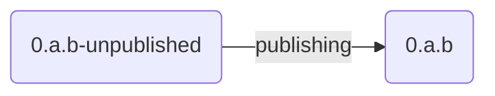

# Version policy

The semver version of the libraries is currently specified twice in the main Cargo.toml:

- `[workspace.package]`
- `[workspace.dependencies]`

The following process should help to ensure a proper semver versioning with multiple code
contributors.

## Published version: `x.y.z`

Let's assume we start developing when the respository is in sync with the latest published version
which we denote here `x.y.z`.

## Code changes: `a.b.c-unpublished`

### *Version handling*

All code changes should be submitted with versions in the form `a.b.c-unpublished`, where either
  `a = x+1` or `b = y+1` or `c = z+1`, i.e., we increment the version according to the needs of
  semver and append the suffix `-unpublished`.

  ```mermaid
    flowchart LR
    published(0.y.z)
    patch-unpub(0.y.z+1-unpublished)
    break-unpub(0.y+1.0-unpublished)
    published   -- non-breaking --> patch-unpub
    published   --   breaking   --> break-unpub
    patch-unpub -- non-breaking --> patch-unpub
    patch-unpub --   breaking   --> break-unpub
    break-unpub -- non-breaking or breaking --> break-unpub
  ```

### *CHANGELOG.md*

A corresponding new entry in CHANGELOG.md should briefly describe the content of the changes.
This is helpful for users of our libraries, but also for ourselves.

Example:

```markdown
# Changelog

## [0.31.0-unpublished]

... foo bar this that ...

Minor version bump due to ....

## [0.30.1] 2024-12-11

(description of published version)
```

Every code change should be described in the `unpublished` section.

## Publishing changes

A publishing change should avoid any code changes and only set the version value
to the appropriate semver value by stripping off the `-unpublished` suffix in the `Cargo.toml`s
and in the `CHANGELOG.md`:

Make sure that all three libs have the same version.



For publishing breaking changes we need to modify additionally the usage section in `README.md`!

### Steps

- Do all necessary changes to `Cargo.toml`, `CHANGELOG.md`, and `README.md`.
- Commit the changes locally
- Run the qualification script successfully
- Push and merge the changes to the master/main branch
- Publish to crates.io
  - `cargo publish --package hdbconnect_impl`
  - `cargo publish --package hdbconnect`
  - `cargo publish --package hdbconnect_async`

## Switching to "1.0.0"

Not sure when to do this.
